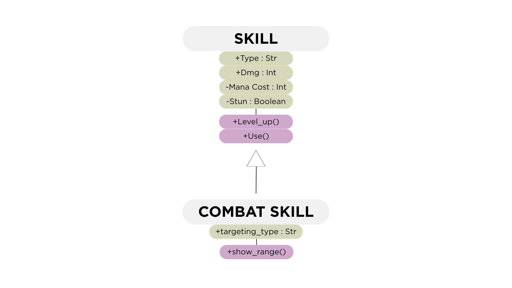
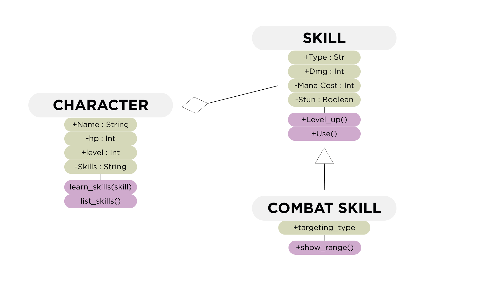
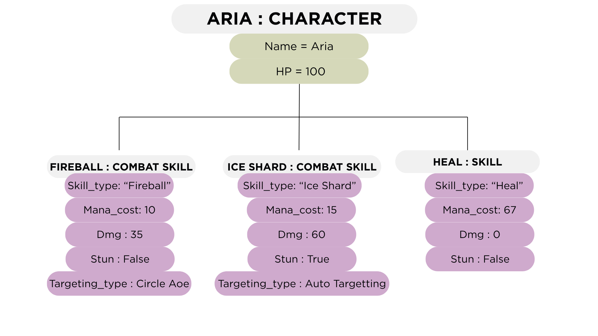

# Advanced Class Relationships
## Previous Activities
[classAttrib](classAttributesMethods.md)
[classRel](classRelationships.md)
## Existing System Description:
The existing system is a game system with two main classes: Skill and Character. The Skill class represents abilities or powers used in the game, while the Character class represents a player who can learn and use different skills. One character can have multiple skills, which was previously represented using association and multiplicity.
## Inheritance Relationship
Parent: skill
Child: CombatSkill
Explanation:
CombatSkill is a specialized type of Skill, so it follows an IS-A relationship. It inherits the attributes and methods of the Skill class. The CombatSkill class also has an additional range_type attribute that describes whether the skill is short-range or long-range. The child class uses super().__init__() to reuse the constructor of the parent class.
## Inheritance UML

## Composition/Aggregation
Relationship: Character ◇── Skill
Explanation: The relationship between Character and Skill is aggregation because a character contains skill objects that can exist independently. The skills are created before they are added to a character using learn_skill(). If the character is removed, the skill objects can still exist separately
## Advanced UML Diagram

## Python Implementation
[Source Code](advancedRelationships.py)
## Test Run

## Object Diagram

## Reflection
Answers: 
1. Why did you choose your inheritance relationship? Explain why your child class is a type of your parent class.

I chose CombatSkill as the child class of Skill because a combat skill is still a type of skill. It has the same basic information and functions as a normal skill, such as its skill type, mana cost, damage, and stun effect. CombatSkill only adds more specific information, which is its range.

2. How did inheritance reduce duplicate code? Identify attributes or methods that were reused.

Inheritance allowed CombatSkill to reuse the constructor and methods from the Skill class. Instead of writing the same code for damage, mana cost, skill type, and skill usage again, I used super().__init__() to reuse the parent constructor. Methods such as get_damage(), level_up(), and use() can also be used by the child class.

3. Why is your HAS-A relationship Composition or Aggregation? Explain the lifecycle relationship between the two objects.

The relationship between Character and Skill is aggregation because the skills can exist independently from the character. In the program, the skills are created first and are then given to the character through learn_skill(). This means the character does not create or completely control the existence of the skill objects.

4. What is the difference between Association from Part III and the advanced relationship you implemented?

Association simply shows that two classes are connected or interact with each other. Aggregation is more specific because it shows a HAS-A relationship where one object contains another object that can still exist independently. In this system, a character has skills, but the skills can exist even without that character.

5. How does your design follow the DRY principle?

The design follows the DRY principle because common code is written once in the Skill class and reused by CombatSkill. The child class does not need to repeat the parent constructor or methods. This makes the program shorter and easier to maintain.
